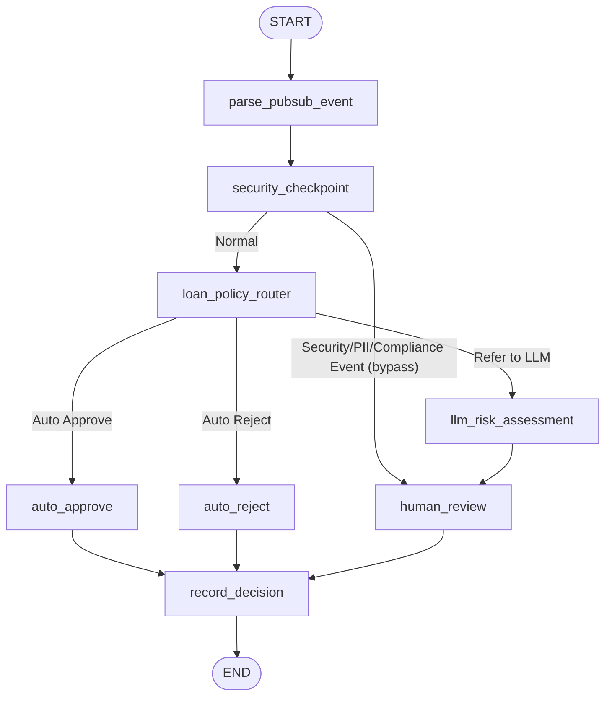

# LoanFlow AI - Production Loan Approval Agent

LoanFlow AI is a production-grade, event-driven banking agent built using the **Google ADK 2.0 Graph Workflow API**. It processes loan applications, checks for compliance and security violations (PII leaks, prompt injections, AML flags), evaluates deterministic business policies, performs AI risk assessments via Gemini 3.1, manages human reviewer input for edge cases, and logs all audit trails in a secure SQLite database.

---

## 1. System Architecture & Workflow Graph

The agent workflow is structured as a directed acyclic graph (DAG) representing the pipeline steps:



### Node Descriptions & Execution Flow

1. **`parse_event`**: Sanitizes the incoming JSON payload (supports both local JSON triggers and base64-encoded GCP Pub/Sub events), auto-generates tracking IDs, and validates fields against a strict Pydantic `LoanApplication` schema.
2. **`security_checkpoint`**: Scans user-supplied text fields for PII (SSNs, credit card numbers, bank routing/account numbers) and replaces them with `[REDACTED]`. It also detects prompt injection patterns (e.g., "ignore instructions", "always approve") and suspicious AML keywords ("money laundering", "smuggling", etc.). Any violation triggers a `security_event` routing bypass.
3. **`policy_router`**: Applies deterministic business rules:
   * **Auto-Approve**: Credit Score $\ge$ 750 AND Loan Amount $<$ \$10,000.
   * **Auto-Reject**: Credit Score $<$ 600.
   * **Refer to LLM**: All other cases.
4. **`auto_approve` / `auto_reject`**: Terminal policy nodes that programmatically log decision state delta and emit user-facing text explanations.
5. **`llm_risk_assessment`**: Invokes Gemini 3.1 Flash Lite to assess debt adequacy, purpose legitimacy, and risk levels (LOW, MEDIUM, HIGH) via structured JSON output.
6. **`human_review`**: Pauses the workflow graph using `RequestInput` if referred to LLM or bypassed due to security events. It awaits reviewer decision inputs ("approve" or "reject").
7. **`record_decision`**: Saves the full compiled `DecisionRecord` including reviewer details, risk analysis, and safety audit trails to a local SQLite database (`loan_decisions.db`).

---

## 2. Security Model

* **PII Redaction**: Regex-based inspection and sanitization of user strings. Replaces identifying numeric values with `[REDACTED]`.
* **Prompt Injection Detection**: Blocks structural override attempts. Injections bypass LLM parsing entirely and are sent directly to human review to prevent prompt jailbreaking.
* **Compliance Screening**: Rejects or flags suspicious keywords referencing illegal financial transactions, money laundering, or smuggling.
* **Auditing**: All decisions are recorded in SQLite and written to a dedicated file log at `artifacts/logs/workflow.log`.

---

## 3. API Endpoints (FastAPI)

Run the server with `make run-server`. It exposes the following endpoints:

* **`GET /health`**: Returns `{"status": "healthy"}`.
* **`POST /trigger/local`**: Starts a loan application flow using local JSON.
  ```bash
  curl -X POST http://127.0.0.1:8080/trigger/local \
    -H "Content-Type: application/json" \
    -d '{
      "applicant_name": "Alice Smith",
      "annual_income": 95000,
      "credit_score": 780,
      "loan_amount": 5000,
      "purpose": "Home upgrade",
      "employment_status": "Full-Time"
    }'
  ```
* **`POST /trigger/pubsub`**: Processes base64-wrapped GCP Pub/Sub events.
* **`POST /resume/{session_id}`**: Resumes a paused session after human review.
  ```bash
  curl -X POST http://127.0.0.1:8080/resume/SESSION_ID \
    -H "Content-Type: application/json" \
    -d '{"human_decision": "approve"}'
  ```

---

## 4. Local Development & Evaluation

### Prerequisites
* **Python $\ge$ 3.11** with **uv** dependency manager.
* A Gemini API Key saved in a `.env` file in the root directory:
  ```env
  GEMINI_API_KEY=your_gemini_api_key_here
  GOOGLE_API_KEY=your_gemini_api_key_here
  ```

### Makefile Targets
Use the following commands for development lifecycle tasks:

* **`make install`**: Install and sync virtual environment dependencies.
* **`make test`**: Run unit test suite using `pytest`.
* **`make playground`**: Launch the local ADK developer playground.
* **`make run-server`**: Run the FastAPI server on port 8080.
* **`make generate-traces`**: Execute the evaluation dataset (19 scenarios) and write traces to `artifacts/traces/generated_traces.json`.
* **`make grade`**: Grade the generated traces via LLM-as-judge and write audit report to `artifacts/grade_results/eval_report.md`.

---

## 5. Directory Structure

```
loanflow-ai-agent/
├── loan_agent/
│   ├── nodes/
│   │   ├── parse_event.py          # Node: Event ingestion & Pydantic validation
│   │   ├── security_checkpoint.py  # Node: SSN/CC redaction, Injection & AML flags
│   │   ├── policy_router.py        # Node: Rules engine, Auto-Approve/Reject
│   │   ├── risk_review.py          # Node: LLM Risk Assessment (Gemini 3.1)
│   │   ├── human_review.py         # Node: RequestInput pause & resumption
│   │   └── record_decision.py      # Node: SQLite persistence & logging
│   ├── agent.py                    # Graph wiring & Workflow definition
│   ├── config.py                   # Business limits, logging & env loading
│   ├── models.py                   # Pydantic schemas & SQLAlchemy models
│   └── server.py                   # FastAPI application
├── tests/
│   ├── eval/
│   │   ├── datasets/
│   │   │   └── basic-dataset.json  # 19 validation scenarios
│   │   ├── generate_traces.py      # Workflow simulation & trace output
│   │   └── grade_traces.py         # LLM-as-judge local evaluator
│   └── test_loan_workflow.py       # pytest unit test cases
├── Makefile                        # Dev pipeline shortcuts
├── pyproject.toml                  # Python packaging & dependencies
└── README.md                       # Documentation
```
